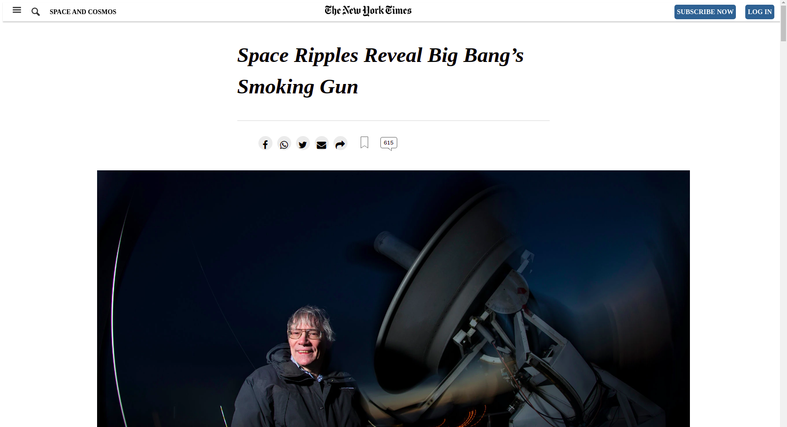
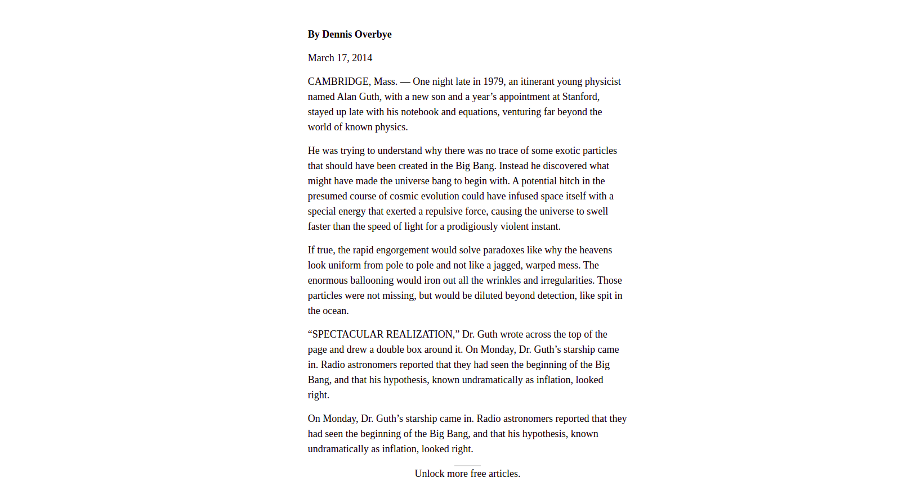

# New-York-Times-Clone
Positing and floating elements using semantic html. New York times clone

This project is a clone of the New times article website  (https://www.nytimes.com/2014/03/18/science/space/detection-of-waves-in-space-buttresses-landmark-theory-of-big-bang.html?_r=0). The objective of the project is the implement(put into use, showcase, cement) the skills learnt in the technical curriculum of microverse, which has to do with the positioning of elements using the various positioning techniques. The positing techniques used for this project are: floats, and flex-box, relative, absolute, fixed.
Additional description about the project and its features.
## Built With
- HTML5
- CSS3
## Live Demo
[Live Demo Link](https://mihndim2020.github.io/New-York-Times-Clone/.)

 main
# screen shot here

- Twitter: [@twitterhandle](https://twitter.com/mihndim)
- LinkedIn: [LinkedIn](https://www.linkedin.com/in/mih-julius-b36848201/)

## 🤝 Contributing

Contributions, issues, and feature requests are welcome!

Feel free to check the [issues page](issues/).

## Show your support

Give a ⭐️ if you like this project!

## Acknowledgments

- My coding partner
- Stand up team
- Mentors
## 📝 License
MIT License

Copyright (c) 2021 Mihndim2020

Permission is hereby granted, free of charge, to any person obtaining a copy
of this software and associated documentation files (the "Software"), to deal
in the Software without restriction, including without limitation the rights
to use, copy, modify, merge, publish, distribute, sublicense, and/or sell
copies of the Software, and to permit persons to whom the Software is
furnished to do so, subject to the following conditions:

The above copyright notice and this permission notice shall be included in all
copies or substantial portions of the Software.
main
